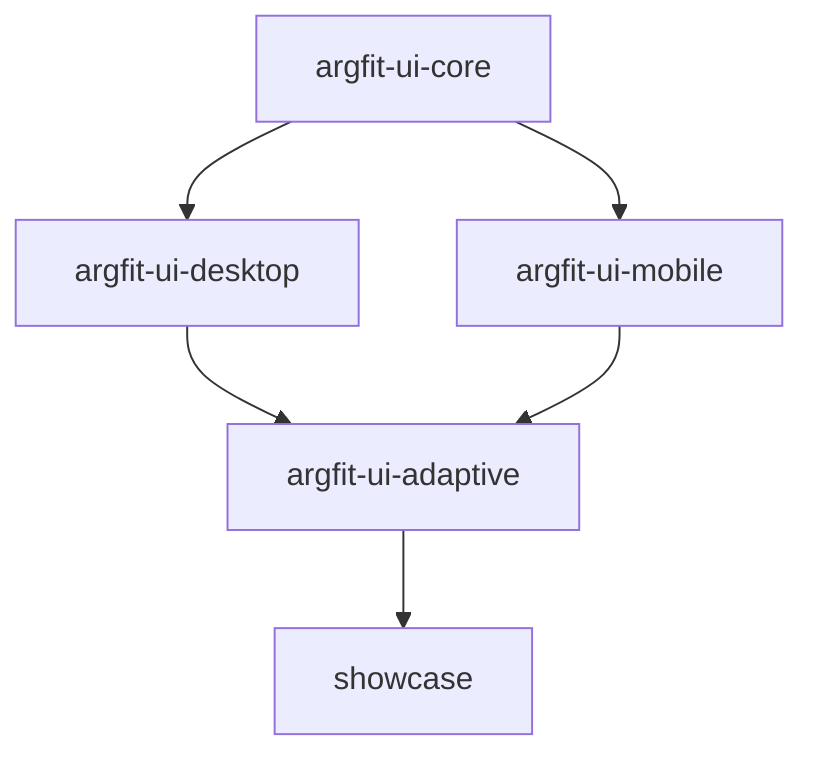
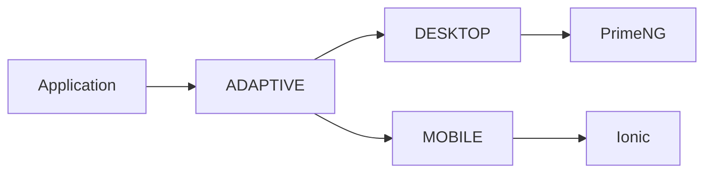

# ArgFit UI — Architecture

# Overview

ArgFit UI is an adaptive Angular UI platform designed to support:

- Enterprise dashboards
- SaaS products
- Mobile applications
- Data-heavy interfaces
- Responsive adaptive experiences

The system provides a unified API while internally rendering:

- PrimeNG for desktop
- Ionic for mobile

---

# Architectural Goals

The architecture aims to provide:

- Long-term scalability
- Platform adaptability
- Vendor abstraction
- Strong design consistency
- Reusable UI patterns
- High developer productivity
- Professional portfolio quality

---

# High-Level Architecture



# Layer Responsibilities

# 1. argfit-ui-core

The core layer contains all shared logic and foundational systems.

Responsibilities:

- Design tokens
- Theme system
- Platform detection
- Shared utilities
- Shared types
- Shared services

The core layer MUST remain vendor-agnostic.

It MUST NOT depend on:

- PrimeNG
- Ionic
- Desktop/mobile implementations

------

## Internal Structure

```
core/
  services/
  themes/
  tokens/
  types/
  utils/
```

------

# 2. argfit-ui-desktop

The desktop layer provides desktop-oriented implementations using PrimeNG internally.

Responsibilities:

- Data-dense layouts
- Enterprise dashboards
- Tables
- Desktop dialogs
- Sidebar navigation
- Desktop forms

PrimeNG is considered an internal rendering engine.

Public APIs MUST remain vendor-independent.

------

## Desktop Philosophy

Desktop experiences should feel:

- Fast
- Dense
- Productive
- Enterprise-oriented
- Keyboard-friendly

------

# 3. argfit-ui-mobile

The mobile layer provides mobile-native implementations using Ionic internally.

Responsibilities:

- Touch-first interactions
- Mobile navigation
- Bottom tabs
- Safe-area handling
- Mobile forms
- Mobile dialogs

Ionic is considered an internal rendering engine.

Public APIs MUST remain vendor-independent.

------

## Mobile Philosophy

Mobile experiences should feel:

- Native
- Lightweight
- Touch-friendly
- Gesture-aware
- Responsive

------

# 4. argfit-ui-adaptive

The adaptive layer orchestrates rendering decisions.

Responsibilities:

- Platform selection
- Responsive rendering
- Adaptive composition

Example:

```
<af-button>
  Save
</af-button>
```

Internally:

- Desktop → PrimeNG implementation
- Mobile → Ionic implementation

------

# Adaptive Philosophy

Adaptive components should:

- Remain lightweight
- Delegate rendering
- Avoid business logic
- Avoid duplication

Adaptive components orchestrate UI decisions, not application behavior.

------

# 5. showcase

The showcase application serves as:

- Documentation platform
- Demo environment
- Visual testing environment
- Portfolio website

Responsibilities:

- Display components
- Display themes
- Display adaptive behavior
- Provide usage examples

------

# Rendering Flow



------

# Design System Architecture

The design system is token-driven.

All visual values must originate from the token system.

------

# Token Categories

```
colors
spacing
radius
typography
shadows
elevation
motion
breakpoints
```

------

# Styling Strategy

The styling architecture uses:

- TailwindCSS
- CSS variables
- Design tokens
- Minimal SCSS

------

# Theme Architecture

Themes are based on CSS variables.

Example:

```
--af-bg-main
--af-primary
--af-text-main
--af-radius-card
```

Themes should be swappable without changing component logic.

------

# Platform Detection

Platform detection is centralized inside:

```
PlatformService
```

Supported platforms:

```
desktop
mobile
auto
```

------

# Public API Philosophy

Public APIs should represent product concepts.

GOOD:

- `AfButton`
- `AfPageShell`
- `AfMetricCard`

BAD:

- `AfPrimeButton`
- `AfIonButton`
- `AfPrimeDialog`

The public API must remain stable regardless of internal implementation changes.

------

# Component Architecture

Preferred component architecture:

```
component/
  component.ts
  component.html
  component.scss
  component.types.ts
```

Avoid giant multi-responsibility components.

------

# State Philosophy

UI state should remain local whenever possible.

Avoid:

- Global state abuse
- Unnecessary reactive complexity
- Tight coupling

Prefer:

- Signals
- Small state scopes
- Explicit inputs/outputs

------

# Long-Term Vision

ArgFit UI aims to evolve into:

- A professional Angular adaptive UI platform
- A reusable enterprise UI ecosystem
- A monetizable premium UI product
- A public engineering showcase
- A scalable design system

------

# Future Planned Systems

Planned future capabilities:

- Theme marketplace
- Premium dashboard blocks
- Enterprise templates
- Storybook integration
- Figma token sync
- Visual regression testing
- CLI generators
- Adaptive analytics components
- Advanced data visualization systems

------

# Architectural Principles

The system prioritizes:

- Simplicity
- Scalability
- Maintainability
- Reusability
- Consistency
- Adaptability

All future HUs should respect these principles.